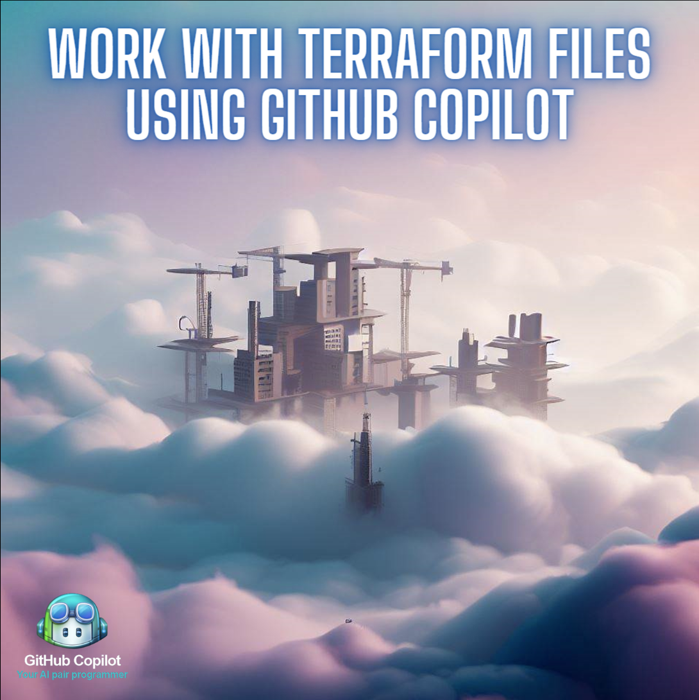

# GitHub Copilot Workshop

## Work with Terraform files using GitHub Copilot

In this fun workshop, you will learn how to use GitHub Copilot to help you work with Terraform files.

Estimated time to complete: `10 to 45 minutes`

Participants will be guided to install the GitHub Copilot VS Code extension, follow a CodeTour to learn how to interact with GitHub Copilot, and then use GitHub Copilot to update, document and create Terraform files. 

## Instructions 

Inside the `.instructions` folder you will find a number of markdown files that contain the instructions for this workshop.

Filename | Description
--- | ---
[1. setup.md](</.instructions/1. setup.md>) | Instructions for installing the GitHub Copilot VS Code extension and joining the GitHub Copilot trial.
[2. getting started.md](</.instructions/2. getting started.md>) | Instructions for getting started with GitHub Copilot.
[3. challenge exercises.md](</.instructions/3. challenge exercises.md>) | Challenge exercises for participants to complete.
[4. additional resources.md](</.instructions/4. additional resources.md>) | Additional resources for participants to explore after the workshop.

## Running a workshop?

If you're planning to run a GitHub Copilot workshop, please review the [workshop guide](</.instructions/workshop organisers.md>) for tips and tricks to help you run a successful workshop. 

## Project Structure

In this project you will find: 

* a `variables.tf` file we'll use to influence Copilot's suggestions
* a `main.tf` file that contains a Terraform module that creates a resource group in Azure
* a devcontainer that installs CodeTour and GitHub Copilot when the Codespace is created (If you want to use Codespaces)
* a `.instructions` folder all the instructions for this workshop.
* an `assets` folder containing images used in this workshop documentation.
* a `.tours` folder that includes the CodeTour file if you wish to use it.

## FAQ 

- **How do I get a GitHub Copilot license?**
  - You can request a trial license from your GitHub Sales representative or via Copilot for Individuals or Business licenses.
- **How do I get a GitHub Codespaces license?**
    - Codespaces is included with GitHub Enterprise Cloud, GitHub Enterprise Server, and GitHub Free. You can check under your [billing settings page](https://github.com/settings/billing).
- **I am having trouble activating GitHub Copilot after I load the plugin, what should I do?**
    - This could be because you launched your Codespace before you activated GitHub Copilot or accepted the invitation to the trial org. Please try to reload your Codespace and try again.

## Acknowledgements

A special thanks to the following awesome Hubbers who have contributed in many different ways to our workshops. 
[blackgirlbytes](https://github.com/blackgirlbytes), [pierluigi](https://github.com/pierluigi), [yuichielectric](https://github.com/yuichielectric), [dchomh](https://github.com/dchomh), [nolecram](https://github.com/nolecram), [rsymo](https://github.com/rsymo), [damovisa](https://github.com/damovisa) and anyone else I've inadvertently missed.

Enjoy your workshop!
[anthonyborton](https://github.com/anthonyborton)

_v1.0 Released May, 2023_
